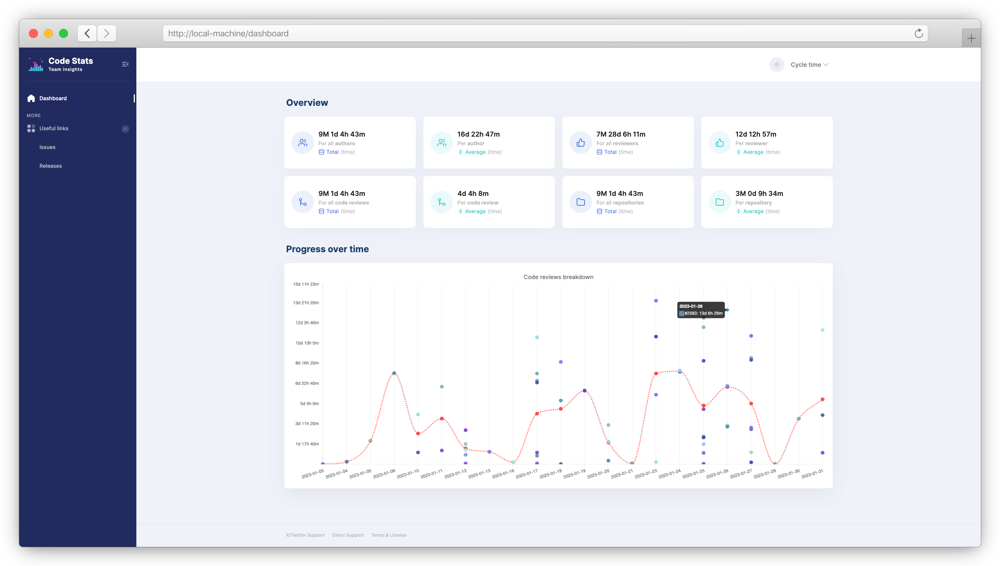
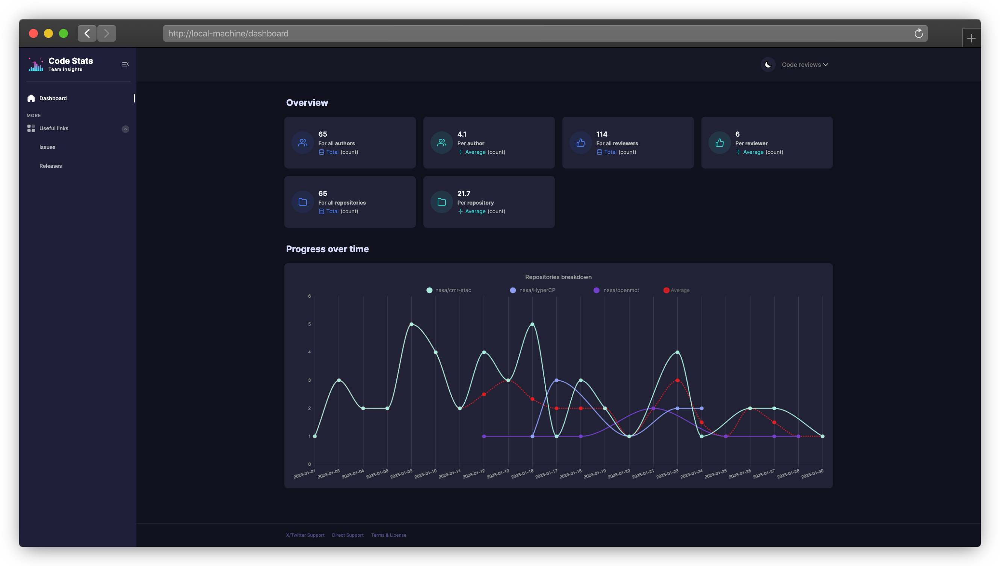

[](https://github.com/milosmns/code-stats/releases)
&nbsp;
[](https://github.com/milosmns/code-stats/actions/workflows/build-ga.yaml)
&nbsp;
[](./LICENSE)
&nbsp;
[](https://github.com/milosmns/code-stats/issues)
&nbsp;
[](https://github.com/milosmns/code-stats/discussions)
&nbsp;

[//]: # (Inspired by https://github.com/othneildrew/Best-README-Template/blob/master/BLANK_README.md)

<br/>
<br/>
<div style="text-align: center" align="center">
  <!--suppress CheckImageSize -->
  
  <h3>Code Stats</h3>

  <p>
    Elevate your performance analysis beyond the contributors page.
    <br/>
    Dive in and transform your team workflows!
    <br/>
    <br/>
    <a href="https://github.com/milosmns/code-stats/issues">Report a bug</a>
    ·
    <a href="https://github.com/milosmns/code-stats/issues">Request a feature</a>
    ·
    <a href="https://github.com/milosmns/code-stats/discussions">Meet & say thanks</a>
  </p>
</div>

### Built using

[](https://kotlinlang.org)
&nbsp;
[](https://ktor.io)
&nbsp;
[](https://github.com/cashapp/sqldelight)
&nbsp;
[](https://www.sqlite.org)
&nbsp;

[](https://www.w3schools.com/html)
&nbsp;
[](https://getbootstrap.com)
&nbsp;
[](https://www.javascript.com)
&nbsp;
[](https://www.chartjs.org)
&nbsp;

#### Support

 &nbsp;
 &nbsp;
 &nbsp;
 &nbsp;
 &nbsp;

## About The Project

Have you ever visited [the Contributors page](https://github.com/nasa/cFS/graphs/contributors) of a GitHub project?
If not, take a look – the data presented there can be very insightful!
You can view data like code frequency, amount of contribution from authors, liveliness of the project.

However, the GitHub page leaves a lot to be desired.
For example, have you ever wondered about your project's [Cycle Time](https://tulip.co/blog/cycle-vs-lead-vs-takt)?
Are you blocking each other, or things are moving smoothly through your development pipeline?
Have you wondered about the evolution of this metric over time?
This metric (and many more) can be computed using the raw contribution data available
in code repositories and at GitHub.

To make time theft more visible, Code Stats aims to provide an alternative interface to GitHub's insights pages.
Take a look at some of the examples below.




## Getting Started

The project is build with [Kotlin/Native](https://kotlinlang.org/docs/native-overview.html)
(supporting multi-platform native binaries).
However, due to complications with the automation pipelines and some issues with Kotlin's native compiler (Konan),
native binary outputs are <u>**temporarily** disabled</u>.

For the time being, you can still use the packages available for the Java Virtual Machine (JVM).

### Prerequisites for running

In order to not get blocked by GitHub for "too many requests" to their APIs,
it is mandatory to provide an authentication token created inside of GitHub.

This is done by setting an environment variable called `GITHUB_TOKEN`.

##### JVM

To run the JVM flavor, you need:

* Java installed and available on the Path; OpenJDK is fine.

### Prerequisites for building

##### JVM

To build the JVM flavor, you need:

* Java installed and available on the Path; OpenJDK is fine.

## How to run

##### JVM

Simply download the latest version from [Releases](https://github.com/milosmns/code-stats/releases)
and run it using Java:

```console
$ java -jar codestats.jar --help
```

## How to build

##### JVM

Clone the project's repository to your local machine.
Then, from the project's root directory run:

```console
$ ./gradlew shadowJar
```

Your output should be exactly the same as the [latest Release](https://github.com/milosmns/code-stats/releases),
and stored in `build/libs/codestats.jar`.

## Usage

For readability purposes, we use `codestats` instead of `java -jar codestats.jar` even when running the JVM flavor.

### Help

The simplest usage is **help** (`-h`, `--help`):

```console
$ codestats --help
```

### Launch modes

There are several modes that Code Stats can run in.

1. **Fetch**  – fetches fresh contribution data and stores it locally for analysis
1. **Print**  – calculates and prints all the code stats (metrics) to `stdout`
1. **Report** – prints a short report on what data is available locally
1. **Serve**  – launches a backend server locally, and prints the access URL for the web UI
1. **Purge**  – deletes all locally stored data

To choose a mode, simply add a `--mode` modifier:

```console
$ codestats --mode=serve
```

### Analysis scope

The basic configuration for the runner comes from a YAML file.
This file can either be next to the `codestats` binary, or pointed to using environment variables and modifiers.

Here's an example:

```yaml
owner: nasa                 # GitHub repository owner
startDate: 2023-01-01       # no data before this date
endDate: 2023-03-15         # no data after this date

teams: # all teams you'd like to inspect
  - title: Flight Team      # GitHub user-friendly team name
    name: nasa-flight       # GitHub team ID
    codeRepositories: # where the code lives
      - openmct
      - HyperCP
      - cmr-stac
      - cFS
    discussionRepositories: # where discussions live
      - cFS
```

You can also supply an external configuration file using the `--config-file` modifier:

```console
$ codestats --config-file=~/.configs/code-stats.yaml
```

You can also refer to the [sample configuration file](./src/commonMain/resources/sample.config.yaml).

### Environment configuration

There are even more configuration options you can use as environment variables:

* <font color="red">`GITHUB_TOKEN`</font> – the (mandatory) authentication token for communicating with GitHub
* `GITHUB_URL` – a REST GitHub Enterprise URL; default is `api.github.com`
* `GITHUB_GRAPHQL_URL` – a GraphQL GitHub Enterprise URL; default is `api.github.com/graphql`
* `GITHUB_PAGING_LIMIT` – how many items to fetch per page (when paging); default is `100`
* `GITHUB_VERBOSE` – whether to print verbose update in the console; default is `false`
* `GITHUB_PRINT_PROGRESS` – whether to print progress updates for GitHub API fetch; default is `true`
* `GITHUB_RATE_LIMIT_DELAY_MILLIS` – a rate-limiting delay for requests to GitHub; default is `2.1s`
* `DATABASE_PATH` – which local database to use (file path); default is `code-stats.db`
* `STATS_PORT_API` – on which port to launch the server for the web UI; default is `8080`

The executable will automatically read these variables and apply them before running.

## Contributing and contact

Contributions are what make the open source community such an amazing place to learn, inspire, and create.
Any contributions you make are **greatly appreciated**. Don't forget to give the project a star! ❤️

To read the contributions guideline, go to [CONTRIBUTING](./CONTRIBUTING).

## License

Distributed under the Non-Toxic GNU GPL v3 License.
See [LICENSE](./LICENSE) for more information about this particular license.
